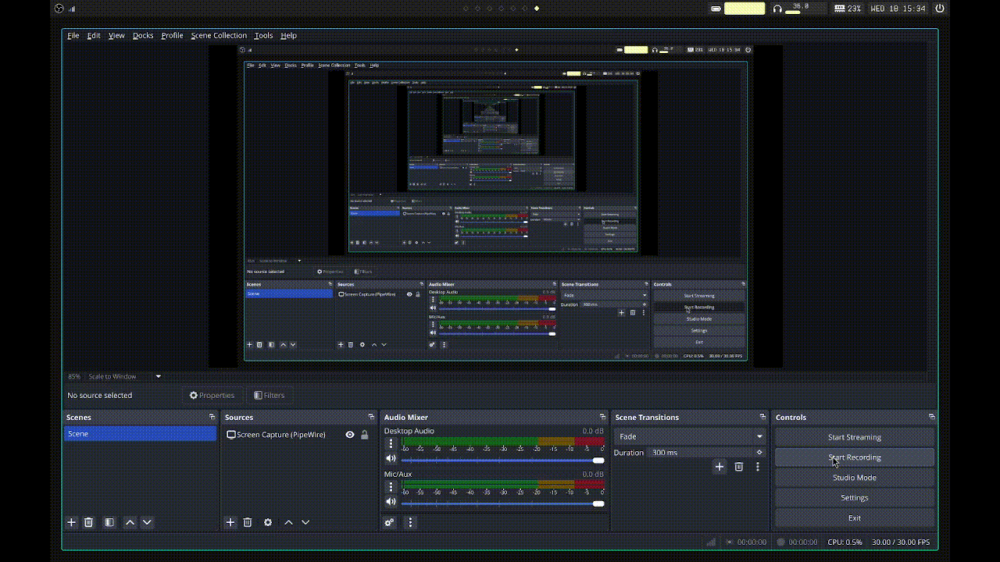

    <h1>huzz bar</h1>
    
h(prland)uzz bar

Somewhat modular bar made for [Hyprland](https://hyprland.org) but it'll probably work with most WMs with a few changes to the implementation of `workspaces-module`.

All margins and padding are hard-coded pixel values, so the bar will probably look horrible on screens with different dimensions than mine.

### Setup
Pending

### TODO
- [ ] add a network module (I technically don't need this since I have nm-applet on systray anyways.)
- [ ] make the shutdown button functional
- [ ] change slider highlight colour if volume exceeds 100
- [ ] add a todo widget
